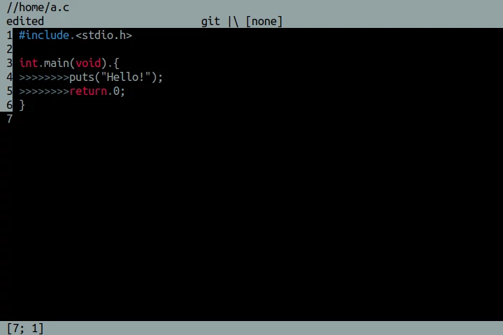

#  fiflo
Edit a text on Linux using Windows keyboard shortcuts.



## Abstract
Learn C. Create a text editor for Linux without any dependencies. Started as
the C pointers and memory management exercise. The goal is to create an editor
that mixes the Atom's rich functionality and Windows-like keyboard bindings
with the Nano's minimalism.

## Features
- Windows-like keyboard shortcuts,
- terminal-based,
- up to 4 files simultaneous editing,
- tabs/spaces recognition/selection,
- syntax highlighting,
- Git branch display,
- punched card, that inverts the e.g. 80th char color,
- easily configurable,
- dependency-free compilation.

## Usage
### Check the minimal requirements for the GNU/Linux:
- `git`,
- `make`,
- `gcc` >= `8.1.0` or `clang` >= ``,
- `gzip` (only for an installation),
- `sudo` (only for an installation, for Debian as root too).

**It's also recommended to use a modern terminal emulator to avoid blinking.**

### Clone on a desktop, compile from source and run
```
git clone https://gitlab.com/mattmaniak/fiflo.git &&
cd fiflo &&
make &&
bin/fiflo
```

### Install
```
sudo make install
```

Then use it directly from a disk...
```
fiflo
```

or better, read the manual...
```
man fiflo
```

and it's configuration guide.
```
man fiflorc
```

### Optional cleanup - remove bin/ and obj/ directories after a compilation
```
make clean
```

### Uninstall
```
sudo make uninstall
```

## Development
Read the "CONTRIBUTING.md" and check the "doc/" directory. The planning is done
spontaneously so differences between commits may be big due the experiments.

### Source files (submodules):
- **args** - passed command-line arguments handling,

- **v_file** - an implementation of the virtual file structure.

- **keys** - stuff that happens after click,

- **config** - configuration file parser and values setter,

- **edit** - more complex text editing operations that happens after the
             keypress,

- **extension** - file extension recognition,

- **fiflo** - **the main file**, just "main" and the execution loop,

- **file_io** - read/save the file, filename live editing,

- **filename** - pathname, basename setting from an arg,

- **input** - get the key and parse it,

- **memory** - real-time automatic memory management for the text buffer,

- **modes** - possible states of the editor, e.g. lower bar expanded,

- **options** - "--help" and friends parameters,

- **punched_card** - vertical line (sometimes called wrap guide)
                     implementation.

- **print** - various magic that prints the text,

- **syntax** - syntax highlighting,

- **ui** - user interface components like bars,

- **window** - window rendering and flushing.

### Tools required for a debugging:
- AddressSanitizer (included in gcc and clang),
- gcov,
- valgrind.

### Checkout the develop branch for new, unstable features.
```
git clone https://gitlab.com/mattmaniak/fiflo.git -b develop &&
git checkout develop
```

### Debugging
Link the AddressSanitizer and add support for the gcov (code coverage checker).
Causes slowdown and huge memory usage.
```
make debug
```

After that and the fiflo execution, there is possibility to check the code
coverage. It will create the cov/ dir and put the every source file with
codecov marked after the previous execution The program must be compiled using
the "debug" option previously. Possible only with the gcc.
```
make coverage
```

Use the valgrind.
```
valgrind -v ./fiflo [optional arg(s) for the editor]
```
Remark: fiflo must be compiled without ASan and MSan.

### Install only the binary with AddressSanitizer linked for debugging.
```
sudo make install_debug
```

## FAQ
Will you port it to the Windows?
- No.
